# HITL 交互指南

本页单独展开 AGW 当前收敛后的 Human-in-the-loop 协议。事实源以 `agent-platform` 最近一轮 HITL 收口后的实现为准：对外交互统一使用 `mode`，当前只有 `question`、`approval`、`form` 三态。

通用边界：

- `awaiting.ask`：声明等待态，并把当前交互定义直接发给前端
- `POST /api/submit`：统一提交 `runId + awaitingId + params[]`
- `request.submit`：记录前端原始 `params[]`
- `awaiting.answer`：记录服务端归一化后的结构化结果
- `tool.result`：交互完成后，原工具继续在同一条流里产出结果

如果你还没有读主线流程，先看 [交互时序图](interaction-sequences.md)；如果你在查字段定义，再看 [HTTP API](../reference/http-api.md) 和 [SSE 事件模型](../reference/sse-events.md)。

## 1. Question



question 用于 `_ask_user_question_` 这类“补信息”交互。当前约定是先发 `awaiting.ask`，再继续把工具参数流完。

事件顺序：

- `tool.start -> awaiting.ask -> tool.args* -> tool.end -> request.submit -> awaiting.answer -> tool.result`

关键点：

- `awaiting.ask.mode = "question"`
- `questions[]` 直接内联在 `awaiting.ask`
- question 默认不带 `viewportType` / `viewportKey`
- `params[i]` 使用 `answer` 或 `answers`，两者必须二选一

典型形态：

```json
{
  "type": "awaiting.ask",
  "awaitingId": "await_001",
  "runId": "run_001",
  "mode": "question",
  "questions": [
    { "id": "q1", "question": "目标读者是谁？" },
    { "id": "q2", "question": "更偏实现还是更偏架构？" }
  ]
}
```

```json
{
  "runId": "run_001",
  "awaitingId": "await_001",
  "params": [
    { "id": "q1", "answer": "前端工程师" },
    { "id": "q2", "answer": "偏实现" }
  ]
}
```

## 2. Approval


approval 主要对应 Bash HITL builtin confirm。当前不再依赖旧 `_ask_user_approval_` 工具路径，而是直接把审批项收敛为 `approvals[]`。

事件顺序：

- `tool.start -> tool.args* -> tool.end -> awaiting.ask -> request.submit -> awaiting.answer -> tool.result`

关键点：

- `awaiting.ask.mode = "approval"`
- `approvals[]` 直接内联在 `awaiting.ask`
- approval 默认不带 `viewportType` / `viewportKey`
- `params[i]` 使用 `decision` / `reason`
- `decision` 的常见值是 `approve`、`approve_prefix_run`、`reject`

典型形态：

```json
{
  "type": "awaiting.ask",
  "awaitingId": "await_002",
  "runId": "run_002",
  "mode": "approval",
  "approvals": [
    {
      "id": "tool_bash",
      "command": "chmod 777 ~/a.sh",
      "description": "放开脚本权限"
    }
  ]
}
```

```json
{
  "runId": "run_002",
  "awaitingId": "await_002",
  "params": [
    {
      "id": "tool_bash",
      "decision": "approve_prefix_run",
      "reason": "同一前缀本轮一并放行"
    }
  ]
}
```

## 3. Form



form 用于 HTML 表单型交互，是当前唯一保留 viewport 语义的 HITL 模式。

事件顺序：

- `tool.start -> tool.args* -> tool.end -> awaiting.ask -> request.submit -> awaiting.answer -> tool.result`

关键点：

- `awaiting.ask.mode = "form"`
- `forms[]` 直接内联在 `awaiting.ask`
- 只有 form 默认保留 `viewportType:"html"`、`viewportKey`、`viewportPayload`
- `params[i]` 可以提交 `payload`、`reason`，或仅提交 `id` 表示取消
- `awaiting.answer.forms[]` 会归一化为 `action: "submit" | "reject" | "cancel"`

典型形态：

```json
{
  "type": "awaiting.ask",
  "awaitingId": "await_003",
  "runId": "run_003",
  "mode": "form",
  "viewportType": "html",
  "viewportKey": "leave_form",
  "forms": [
    { "id": "form-1", "initialPayload": { "days": 2 } }
  ],
  "viewportPayload": {
    "forms": [
      { "id": "form-1", "command": "submit_leave_request" }
    ]
  }
}
```

```json
{
  "runId": "run_003",
  "awaitingId": "await_003",
  "params": [
    {
      "id": "form-1",
      "payload": {
        "employeeName": "Lin",
        "days": 2,
        "reason": "Conference"
      }
    }
  ]
}
```

## 4. 需要记住的边界

- question / approval / form 都不再使用分离式 payload 事件
- 三态统一使用 `mode`，不再用 `kind` 作为对外主字段
- `request.submit` 是原始输入回看事件，`awaiting.answer` 才是归一化结果
- `params[]` 顶层始终是数组，按顺序对应当前批次 item
- 只有 form 默认保留 viewport 相关字段
